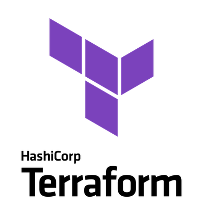

# Autobot Automation using Terraform

This project uses Terraform to manage infrastructure on Google Cloud Platform.

## Overview

- **Provider**: Google Cloud
- **Modules**: 
  - Cloud Functions
  - Pub/Sub
  - Cloud Scheduler
  - Function Storage

## Requirements

- Terraform 1.x
- Google Cloud SDK

## Usage

1. Clone the repository.
2. Update the `provider.tf` file with your Google Cloud credentials.
3. Run `terraform init` to initialize the project.
4. Run `terraform apply` to apply the changes.

## License

This project is licensed under the MIT License.
